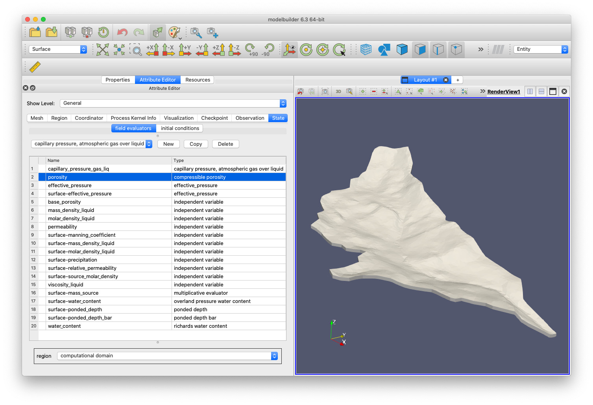

# ResonantHPC

Please visit our website: [kitware.github.io/resonanthpc/](https://kitware.github.io/resonanthpc/)

ResonantHPC is designed to increase scientific productivity by providing HPC
capable pre-and-post processing for easier and faster turnaround and
integration with modern and next-generation simulation systems.
This system will extend the standard scientific computing environment
(Jupyter) so that researchers can prepare, execute, and analyze the results
of remote exascale-level simulation from their workstations.

ResonantHPC will:
* provide a data integration module that enables pulling data from
  heterogeneous sources as well as running required preprocessing.
* include a modeling interface that enables the user to generate
  an input mesh (through the execution of an external mesher) and
  to associate additional attributes to mesh elements.
* enable, through a simple user interface, the execution
  and monitoring of HPC jobs such as preprocessing, simulation and
  visualization modules.
* incorporate a leading parallel analysis and visualization module.
* run inside a web browser and provide both user interface and
  scripting access to its functionality.

## Acknowledgment

This material is based upon work supported by the U.S. Department of Energy, Office of Science, Office of Acquisition and Assistance, under Award Number DE-SC0020503

## Project Team

- [Aashish Chaudhary](https://github.com/aashish24) - Kitware, Inc.
- [Bane Sullivan](https://github.com/banesullivan) - Kitware, Inc.
- [John Tourtellott](https://www.kitware.com/john-tourtellott/) - Kitware, Inc.
- [Dan Lipsa](https://www.kitware.com/dan-lipsa/) - Kitware, Inc.
- [David Moulton](https://github.com/jd-moulton) - Los Alamos National Laboratory
- [Dipankar Dwivedi](https://eesa.lbl.gov/profiles/dipankar-dwivedi/) - Lawrence Berkeley National Laboratory

## Software Utilized

The following are a list of the open-source software we are utilizing in this
effort.

- [ParaView](https://www.paraview.org)
- [Amanzi and ATS](https://amanzi.github.io)
- [Computational Model Builder](https://www.computationalmodelbuilder.org)
- [SMTK](https://smtk.readthedocs.io/en/latest/)
- [LaGriT](https://lanl.github.io/LaGriT/)
- [Project Jupyter](https://jupyter.org)

## Connections

In addition to this repository, several other tools are being developed for
this effort. Please take a look at these connected repositories:

- [`ipyvtk_simple`](https://github.com/Kitware/ipyvtk-simple)
- [`ipyparaview`](https://github.com/Kitware/ipyparaview)

## Project Concept and Goal

ResonantHPC is building a turnkey platform for model-data integration that
simplifies access to data and processing, simulation model input generation,
and validation across scientific computing workflows.
This project is focused on providing open-source tools to model input
generation, run models easily at scale, and then interactively visualize models
using world-class ParaView and Jupyter. Our current efforts are focused on
providing this workflow for the [Amanz/ATS](https://amanzi.github.io)
hydrological simulation software.

The left side of this workflow entails defining the input parameters to set up
the simulation in Computational Model Builder.

We then run the simulation with the defined problem, yield results and provide
an end-to-end platform for running simulations and visualizing their results.

