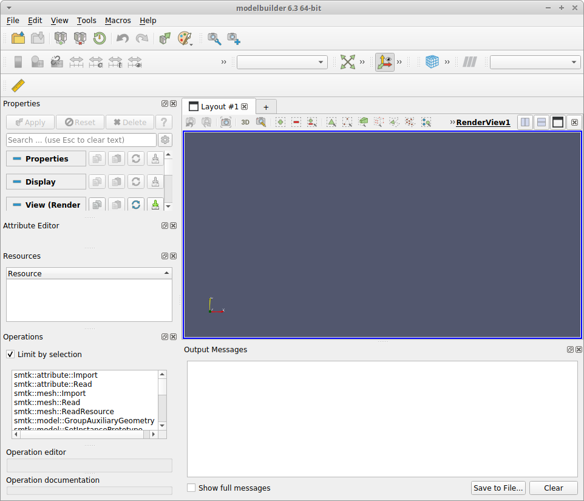
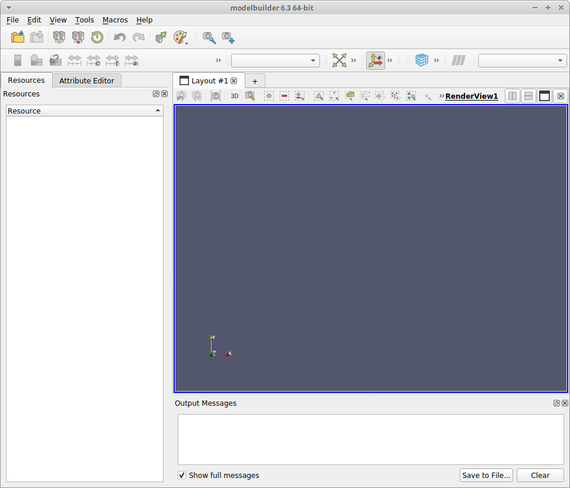

# ResonantHPC Modelbuilder View Setup

When starting modelbuilder for the first time, a number of view panels appear
on the left-hand side of the application, as shown in this screenshot.

Each panel is a Dock Widget that can be closed or
undocked in the same way that ParaView panels work. For simulation preprocessing,
the following setup is recommended, although users can chose whatever
configuration they prefer:

* Close the Properties and Operations panels
* This should leave 2 view panels, labeled Attribute Editor and Resources.
* Undock the Resources view and drag it over the Attribute Editor view,
  so that it docks as a second tab.
* Drag the left-hand panel so that it occupies approximately 1/3 of the
  widown size.You can change any of the fields as preferred, but
* On the right-hand size, drag the Output Messages panel to be smaller,
  leaving more space for the Render view.
* To free up more vertical space, you can also remove tool bars from the
  View menu.

The end result should look something like this screenshot.

.
