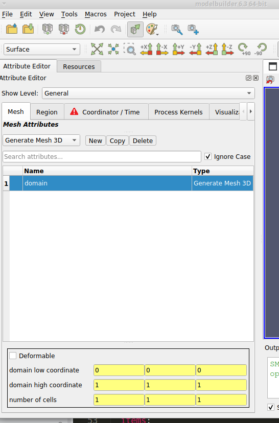

# ResonantHPC ATS Demo 1

This documents describes the process of creating an ATS input for the
[ats-demos](https://github.com/amanzi/ats-demos), specifically the
`01_richards_steadystate` example. Users should first be sure to
complete the steps outlined in the `01-development-setup.md` and
`02-view-setup.md` files.

## Load ATS template

The first step for producing any simlation is to load the modelbuilder
user interface "template", which specifies the various properties
used to specify a simulation input. These files use XML format, but
typically have the extension `.sbt`.

Use the "File" => "Open" menu item and select
`dev/cmb/simulation-workflows/ats.sbt` from this repository.

Because this example does not use any geometric model input,
you can expand the left hand panel to the right, to expose
more of the Attirbute Editor tab.

The Attribute Editor should now display these horizontal tabs,
corresponding to the top-level sections of the ATS input
specification.

* Mesh
* Region
* Coordinator/Time
* Process Kernels
* Visualization
* Checkpoint
* Observation
* State

The left-hand side of the user interface should look similar to
this screenshot.


## Save attribute resource

When modelbuilder opens the `ats.sbt` file, it creates a CMB *attribute
resource* instance, which stores the data that will be entered from the
modelbuilder user interface. As with any work product, it is a good idea
to write that resource to the file system as you make changes. To do this,
select the "File" => "Save Resource" menu item, which will open a file
dialog to select the directory and filename to use. Navigate to some work
area you use for data files and enter "demo01.smtk" in the "File name"
field. Note that modelbuilder resource files must use the extension
".smtk" (which stands for "Simulation Modeling ToolKit).


## Mesh attribute

In the Mesh tab, we want to create one attribute to represent the problem
domain. To do that, click on the dropdown box just below the "Mesh Attributes"
label and select, select the "Generate Mesh 3D" item, and click the "New"
button to the right of the dropdown box. In repsonse, modelbuilder will
create and display a new mesh "attribute" as one row in the middle section
and with an editing panel below the list area. The left-hand side should
now look like this screenshot.



In the middle area, double-click on the Name item ("mesh.generate.3d-0")
to edit the text and change it to "domain" (click `<Enter>` to finish
editing.) Note that all project must have one mesh named "domain" in
order for modelbuilder to generate a working ATS input file.

In the lower section are editing panels labeled "domain low coordinate",
"domain high coordinate", and "number of cells".

* You can leave the "domain low coordinate" at 0, 0, 0.
* Change the "domain high coordinate" to 1, 1, 10 (which only requires
  editing the third column).
* Change the "number of cells" to 1, 1, 100 (which only requires
  editing the third column.)

When complete, the tab should look like this screenshot, with the
only different being the two fields edited in the lower section.


Note that after editing an item, the background color
changes from yellow to white. The yellow color indicates that the
current value is the default value specified in the .sbt templates.
White indicates the value is not the template default.

The background color is red if a value is invalid or missing.
The modelbuilder user interfaces applies some validation checks
which prevent users from enterting invalid values.
For example, you cannot enter text in the various fields for
this (mesh) attribute. You also cannot enter negative values
for the "number of cells" fields.

Now would be a good time to save the attribute resource, before
going to the next section.


## Region attributes

A total of seven region attributes are used in the ATS Demo01
example. To specify these, move to the "Region" tab in the
attribute editor.

The first region attribute is type `region: box 3D`, so select
that in the dropdown list and click the "New" button. Edit the
name to be "computational domain" and enter the coordinates

* low coordinate 0,0,0
* high coordinate: 1, 1, 10

The other siz attributes are of type `region: plane 3D`. Create
those attributes using the following data:

```
  name: bottom face
  items:
    - 'point':  [0.5, 0.5,  0.0]
    - 'normal': [0.0, 0.0, -1.0]

  name: east face
  items:
    - 'point':  [1.0, 1.0, 0.0]
    - 'normal': [1.0, 0.0, 0.0]

  name: north face
  items:
    - 'point':  [1.0, 1.0, 0.0]
    - 'normal': [0.0, 1.0, 0.0]

  name: south face
  items:
    - 'point':  [0.0,  0.0, 0.0]
    - 'normal': [0.0, -1.0, 0.0]

  name: surface
  items:
    - 'point':  [0.5, 0.5, 10.0]
    - 'normal': [0.0, 0.0, 1.0]

  name: west face
  items:
    - 'point':  [0.0, 0.0, 0.0]
    - 'normal': [-1.0, 0.0, 0.0]
```

Once again, you should save the attribute resource before
continuing.

## Other attributes

The remaining sections

* Coordinator/Time
* Process Kernels
* Visualization
* State

Not used in this demo are the Checkpoint and Observation sections.


## Run export operation to generate ATS input file
